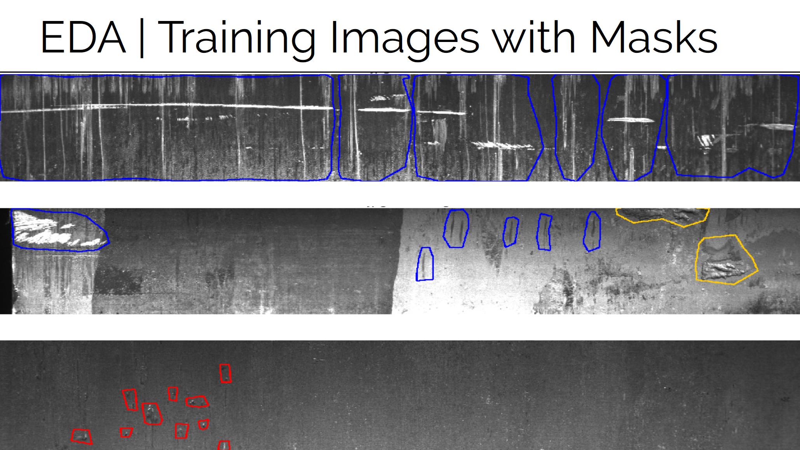
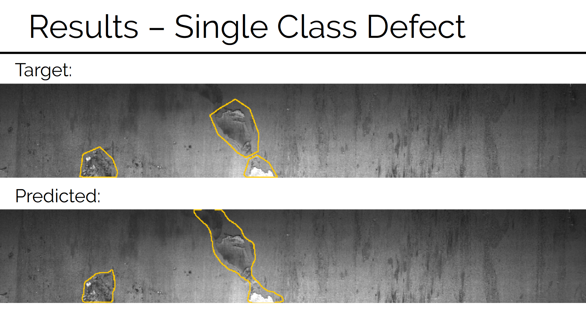

# Steel Defect Segmentation
Analyzes existing customer data, generates and visualizes new customer shopping behaviour.

[Link to presentation](presentation.pdf)

## Data Source
https://www.kaggle.com/c/severstal-steel-defect-detection/data

## References
- Olaf Ronneberger, Philipp Fischer, Thomas Brox. "U-Net: Convolutional Networks for Biomedical Image Segmentation" arXiv:1505.04597 [cs.CV]
- Kaiming He, Xiangyu Zhang, Shaoqing Ren, Jian Sun. "Deep Residual Learning for Image Recognition" arXiv:1512.03385 [cs.CV]
